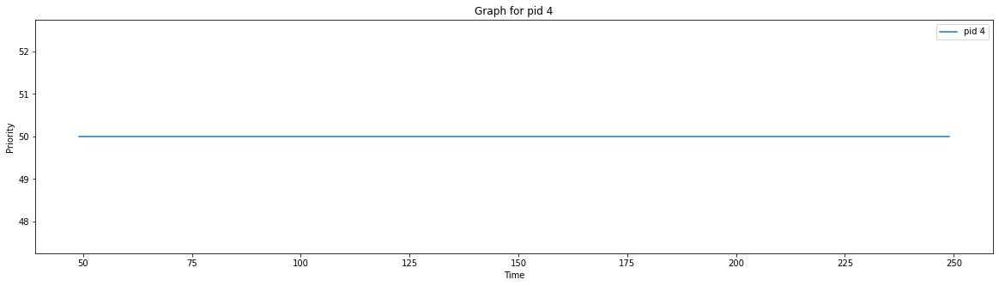
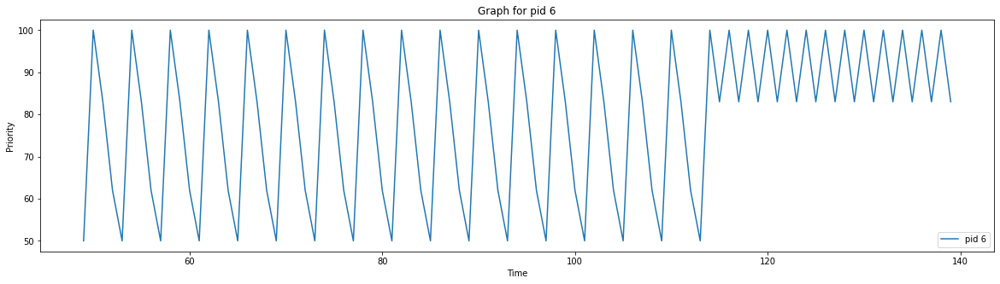
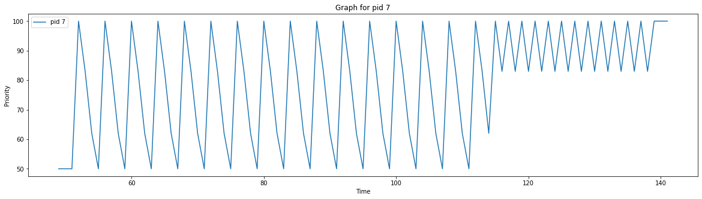
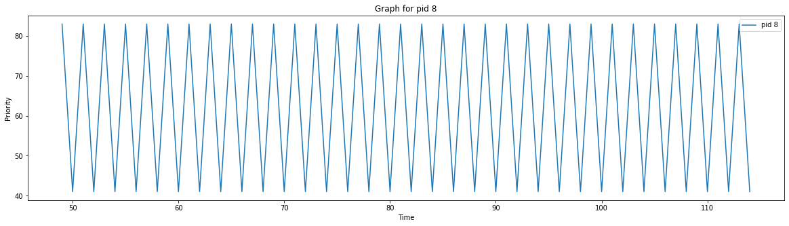
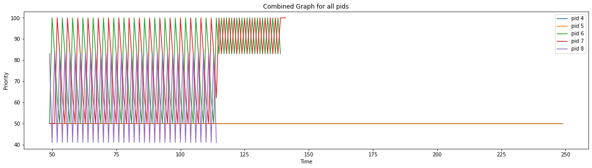

# OSN Monsoon 2023 mini project 3
## xv6 revisited and concurrency

## Report for Mini Project 3
### Amey Choudhary
### 2021113017

## Part 1: PBS Scheduler

- Static Priority: The static priority will allow us to modify the priority of a process. 

- RBI: The runtime increases with time and this causes RBI to increase. So, it decreases priority of running process and allows starved process to gain CPU

I have added images for my PBS plots.
The average rtime is 15 and wtime is 111.

## Part 2: COW

No Questions have been asked

## Part 3: Cafe Sim

- Waiting Time:

The waiting time would reduce to 1 in infinite baristas. This is because whenever a new customer comes in, a barista would already be free and there to serve  them. They would only take time to order the coffee

- Coffee wasted :

Assuming that all customers are having tolerance time >= time to prepare the coffee, the coffee wastage would be 0.

In our sample input, waiting time is 2.33 and the coffee wastage is 1.

## Part 4: Ice Cream Parlour

Input is terminated by "/"

- Minimizing Incomplete Orders: 

In our implementation, we would reject a customer for ingredient shortage only when first placing their order. This causes a problem when another customer's order utilises the ingredients between the previous customer's order placement and preparation start. To avoid this, we can reserve ingredients on placement of order itself. To implement, we can check and then decrement the ingredients(reserve for a customer). Now, only those orders are accepted which can be for sure completed. 

- Ingredient Replenishment: 

In case we have to wait sometime for replenishment of ingredients, we can ignore those orders whose inngredients are missing and take up those which we can make. When it gets replenished, we can go back to making those orders.

- Unserviced Orders: 

To avoid unserviced orders, we can find time remaining for free machines. And then schedule our bigger orders to machines with most free time remaining

